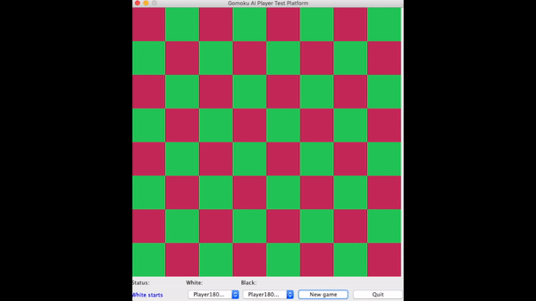
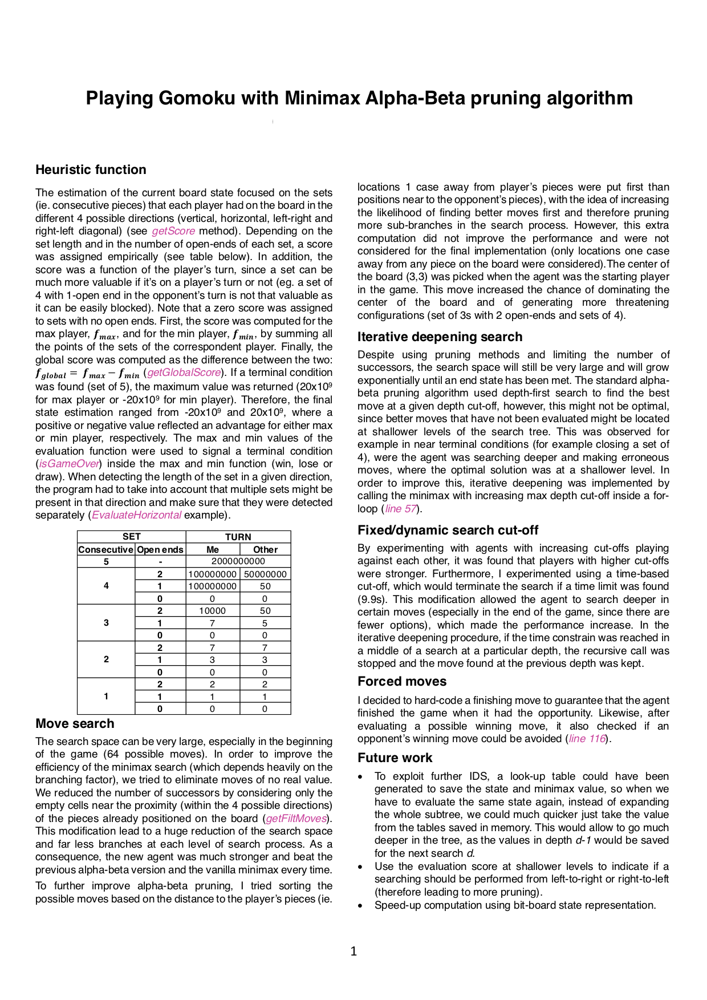

# Playing Gomoku with minimax alpha-beta pruning algorithm
- Program developed in Java as part of the AI module at Queen Mary University of London.
- Solution built reached 4th place in the class competition of 100+ students.
- GUI for the game was already provided.

### Instructions:
Two players (white and black) take turns at placing a stone of his/her colour on an unoccupied square on the board (white moves first). The first player to complete a continuous horizontal, vertical or diagonal line of 5 or more stones of his/her colour is the winner (scoring 2 points). The loser scores 0. If all squares are occupied and neither player has won, then each player gets 1 point.

### Restrictions:
- Time limit of 10 seconds per move. Any program which exceeds this limit will immediately forfeit the game to its opponent. 
- Similarly any program which raises an exception or makes an illegal move (out of range or already occupied) will lose immediately. There are no other restrictions on moves (gomoku experts may be aware that some tournaments have further restrictions).

### Solution:

